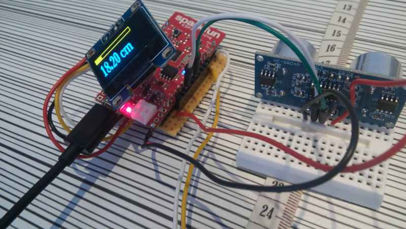

Ultrasonic sensor to measure the distance and a 1306 display to show the results.

Note that this is a 3.3V only version of the ultrasonic sensor.

https://www.aliexpress.com/item/HC-SR04P-Ultrasonic-Ranging-Module-Ranging-Sensor-Module-3-5-5V-Wide-Voltage-Performance-Is-Stronger/32711959780.html

https://www.aliexpress.com/store/product/Free-shipping-Yellow-blue-double-color-128X64-OLED-LCD-LED-Display-Module-For-Arduino-0-96/1735233_32665937977.html?spm=2114.12010608.0.0.4xaOy8




##Compiling U8G2
To use the actual U8g2 library in your ESP32 project, perform the following steps:

1. Create a directory called `components` in your main project directory.
2. Change into the `components` directory.
3. Run `git clone https://github.com/olikraus/u8g2.git` to bring in a the latest copy of u8g2 library.
4. Change into the `u8g2` directory.
5. Create a file called `component.mk`
6. Enter the following in the `component.mk` file:
```
COMPONENT_SRCDIRS:=csrc
COMPONENT_ADD_INCLUDEDIRS:=csrc
```

