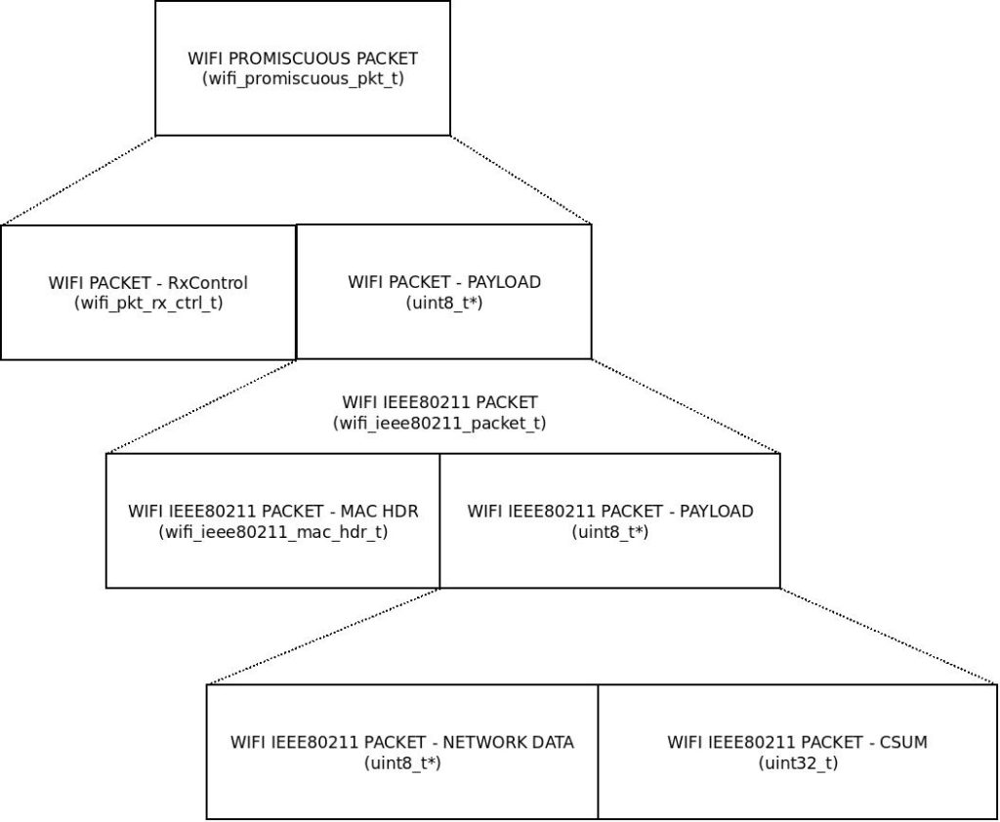

#  ESP32 - WIFI_PROTOCOL_LR

Experiments with the WIFI_PROTOCOL_LR.

Inspired by Ivans Grokhotkovs RC-airplane, where he use the WIFI_PROTOCOL_LR
https://www.esp32.com/viewtopic.php?t=1001

And by Jeija
https://www.youtube.com/watch?v=yCLb2eItDyE&feature=youtu.be

This one reqires that you have 2 ESP32:s.
You will have to change main.c and 
on the first init_wifi(WIFI_MODE_AP), the other init_wifi(WIFI_MODE_STA);

The one compiled with WIFI_MODE_STA must be equiped with a ssd1306 i2c display. 
Pin 4 = SCL , Pin 5 =SDA.
  #define I2C_MASTER_SCL_IO    4
  #define I2C_MASTER_SDA_IO    5 

Or you can bring a laptop and watch the RSS value from the logs.

If you have a 1306 the bar will show the rssi absoulute value,and my guess is that its in dB. Smaller value indicates better reception.

Also double check the mac address filter used for logging, It must match the filter but 24:0a:c4 is registered for Espresstiff Inc.
```
if ((hdr->addr2[0]==0x24) && (hdr->addr2[1]==0x0a)) {
}
```

Not really sure what WIFI_PROTOCOL_LR does.
Expect to see a AP Start failed and sta start fail. Its normal and will work
anyways. Check the first link on page 2 to see the logs to expect.

When I get the time I will compare normal protocol with WIFI_PROTOCOL_LR.

#  My Hardware

For my hardware I used a Duino, https://www.tindie.com/products/lspoplove/d-duino-32esp32-and-096oled-display/
really nice.

But you can also buy a 1306 display for 3$ on AliExress,
https://www.aliexpress.com/item/blue128X64-0-96-inch-OLED-LCD-LED-Display-Module-For-Arduino-0-96-SPI-Communicate/32666001037.html?spm=2114.12010108.1000023.7.5CLO03


This does not yet run in qemu but hopefully it will start one day. 





